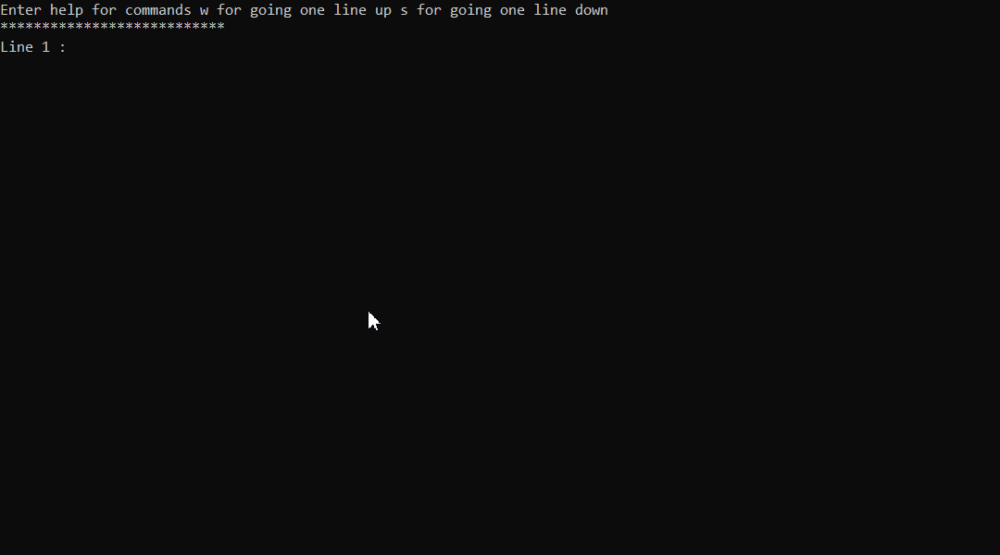

# Stress Testing and Test Generation Framework for Competitive Programming

A powerful tool for **automated test generation** and **stress testing** for competitive programming.
This framework offers an easy, fast, and modular approach to create **random test cases**, **find edge cases** that might break your code, **generate tests** based on problem statements, and even **verify your algorithm** against a brute force solution.

## Features

- **Stress Testing**: Easily test your code to find edge cases, check for time limit scenarios, and verify solutions.
- **Random Test Creation**: Generate random tests using scripts or custom-defined random tests, and have them ready for stress testing.
- **Test Script Generation**: Create structured test cases using custom scripts (e.g., `matrix x -n 10 -m 20 columns` generates a random matrix with 10 rows and 20 columns).
- **Script Reusability**: Save and reuse scripts for various problem types, speeding up the testing process.

---

## 🚀 Quick Start

1. Clone the repository:
   ```bash
   git clone https://github.com/username/stress-test-framework.git
   cd stress-test-framework
   ```

2. Set your compiler path:
   - In `Src/Input.h`, specify your compiler path.
   ```cpp
   const std::string COMPILER_PATH = "C:/mingw64/bin/g++.exe";
   ```

3. Build the project:
   ```bash
   # Adjust to your setup if necessary
   g++ -O2 -o stress_test main.cpp
   ```

4. Run the main program:
   ```bash
   ./stress_test
   ```

---

## ⏩ Efficiency and Fast Test Creation

This framework is designed to streamline test creation and execution. With predefined commands and reusable scripts, you can run tests, generate random inputs, and compare results within seconds.

---

## 📚 Usage Guide

### Basic Workflow

1. **Create Random Tests**: Generate random tests first, using either predefined scripts or custom generation.
2. **Add the Correct code and the code to be tested Code**: Place your correct code in `CorrectCode.cpp` and your solution in `MyCode.cpp`.
3. **Run Stress Test**: The framework will generate outputs and compare results between the correct code and your code to **find wrong answers and time limits cases.**

### Command Syntax

Commands follow a simple structure:
```
Command - Name - Flags - Flag Arguments
```

For available flags or details on specific commands, type:
```
Help
```

Example:
- To generate two integers within specific ranges:
  ```text
  int n -r 10 20 , int m -r 100 200
  ```
  This will generate `n` in the range [10, 20] and `m` in the range [100, 200]. The framework’s validation ensures syntax correctness.

### Creating Random Tests

You have three ways to create random tests:
- **Test Script**: Run a predefined script to generate tests.
- **Custom Test**: Use `CustomTest.cpp` to define and run your custom test generation logic.
- **Load Existing Script**: Load and modify an existing test script to match your current test case requirements.

### Running the Stress Test

After generating random tests:
- Place the correct code in `CorrectCode.cpp` and your solution in `MyCode.cpp`.
- Start the stress test, and it will automatically compare outputs to highlight any inconsistencies.

---

## 🌟 Demonstrations

### 1. Generating Custom Tests with Commands

Generate tests with specific ranges and structures using custom scripts.

**Example: Creating a Test**  


### 2. Running and Saving Custom Scripts

Run created tests or load a previous test script from the scripts directory. This example generates two numbers on the same line, followed by a string of length `n` and a binary string of the same length.


### 3. Error-Free Command Validation

Built-in validation ensures you don’t need to worry about syntax errors in your commands.



### 4. Output Comparison and Stress Testing

Run your code against the correct code on any number of randomly generated tests quickly and efficiently.


---

## 👥 Contributing

Feel free to open issues or pull requests for bug fixes, new features, or improvements.

## 📄 License

This project is licensed under the MIT License.